## Rapports de séance Brice Mabille

- 06/12/2022 : Setup du projet GitHub partagé

# Séance 6:

In this session, I started by 3D printing the Auger and the gear system.

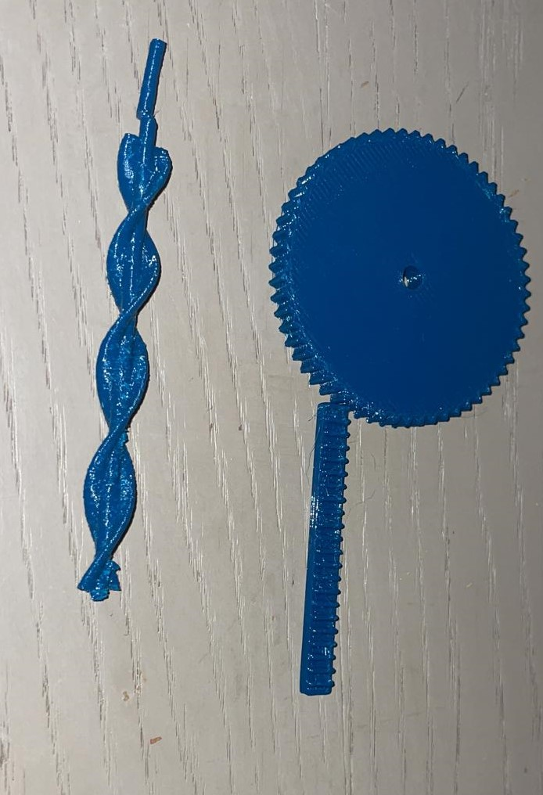

Sadly, I wasn't entirely certain about the dimension, thus it was a first attempt. I watched it since the outcome was too meager and insufficient for drilling into the floor.

So I adapted the dimension, the filling and I printed it again. This time the Auger was nice except the joint to link the Auger with the motor and the gear system had this issue too.

|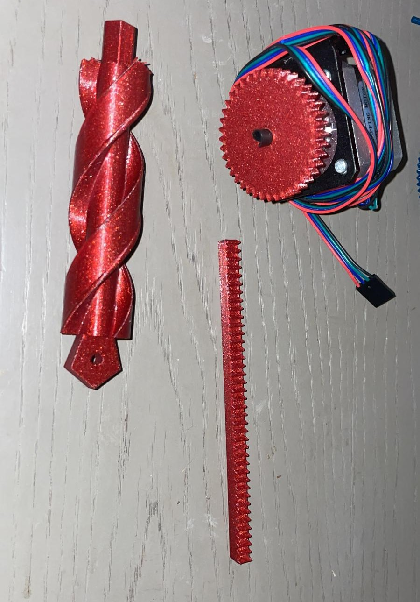|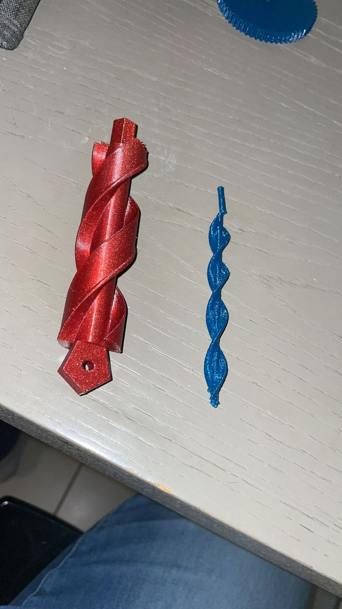|
|:---:|:---:|

With those prints, I modified the gear system model to include a holding device, which will enable the stepper to be properly maintained at this time.

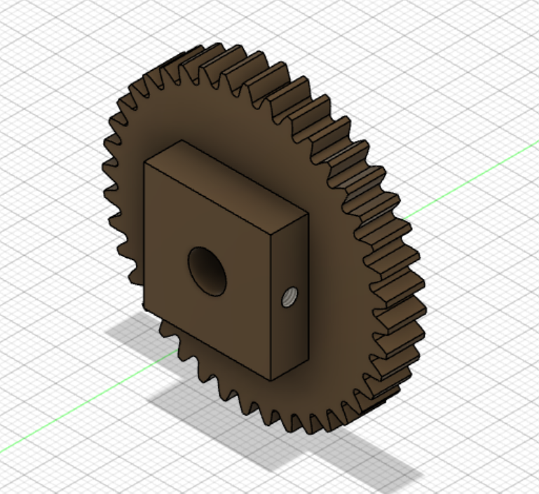

But for the Auger, I wanted to post-treat to insert it in the mandrel.

Second, with Sébastien Juan's assistance, we make a small hole in the mandrel and insert it into the motor.
It was a great idea but we believe that the Auger will not revolve properly.

Unfortunately, when I used the Auger to test the motor, I damaged it, making it impossible for me to determine whether the rotation was accurate.

However, it enables me to test the motor's operation.

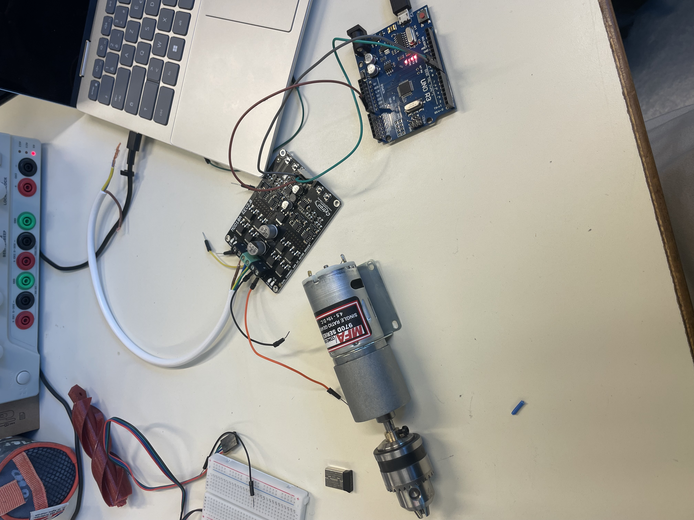

Furthermore, I researched the system Jaime and I had selected to model before I started the Lidar system.
When I watched the movie again, I saw that the author's modelization was available online on github, so I copied it and printed it.

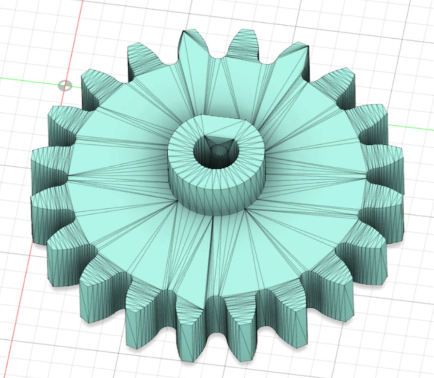
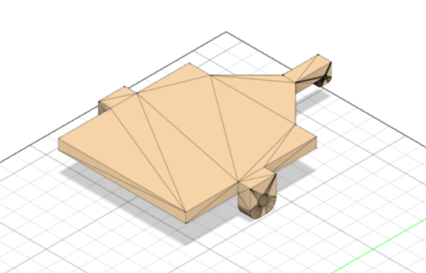

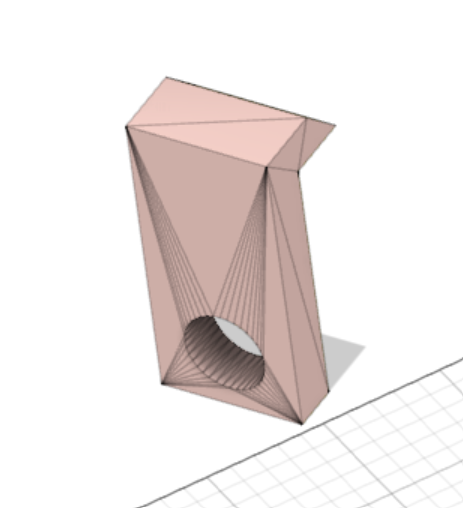
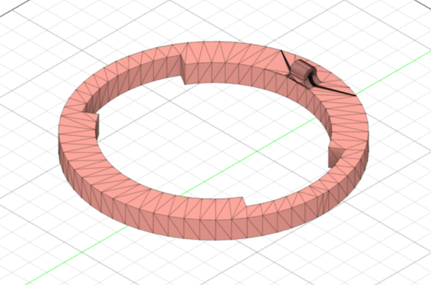
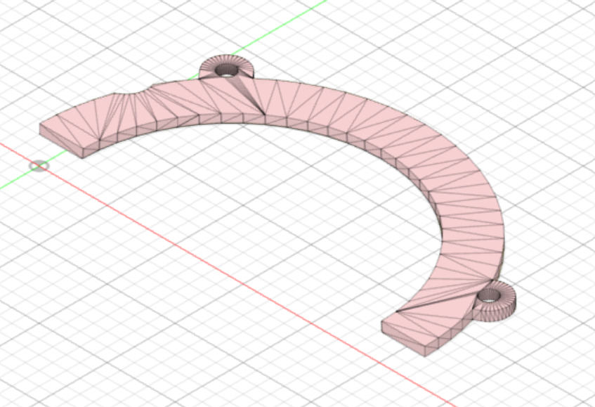
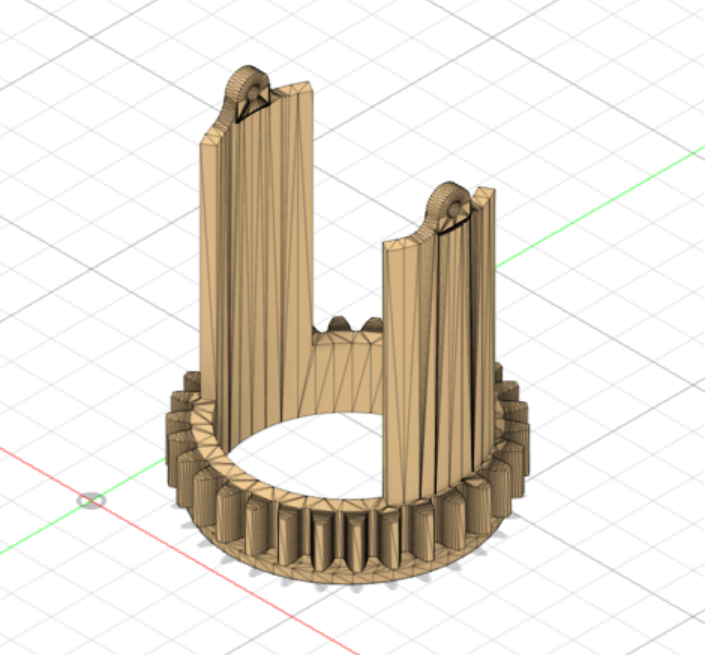
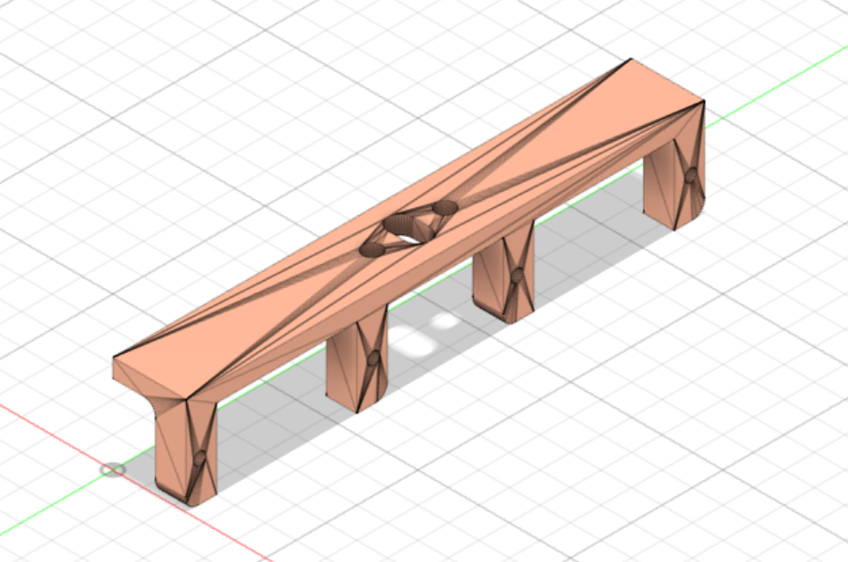
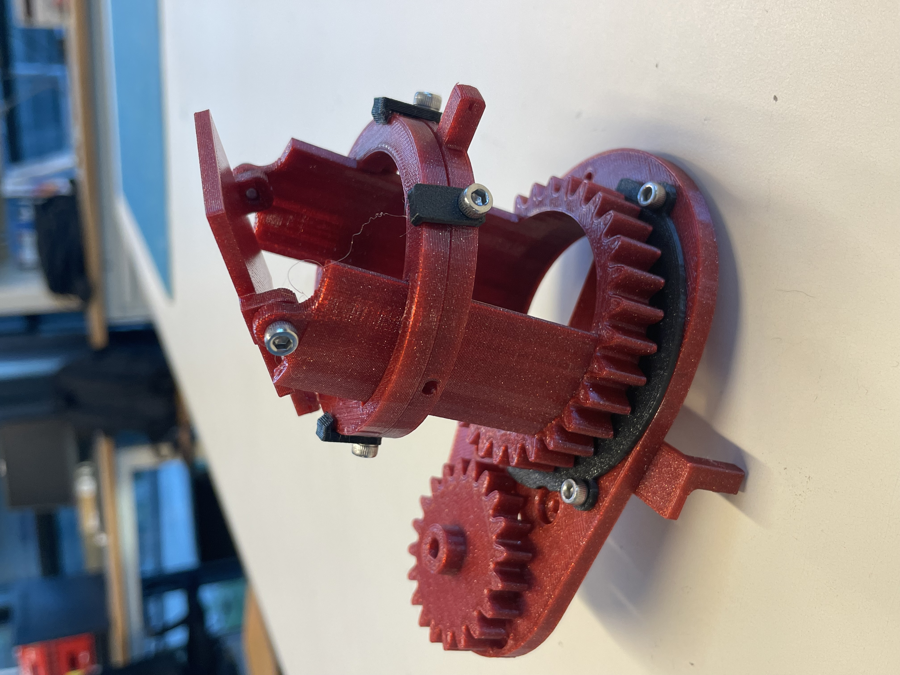

Moreover, I had to use a laser cutter to cut the water and seed stock that I designed in Inkscape. I'll then assemble it with silicone to ensure proper sealing.

In order to observe how it functions, I finally put the stepper in operation with the gear and the rack. However, when I powered up the circuit, nothing happened, so I will try again at the following session.

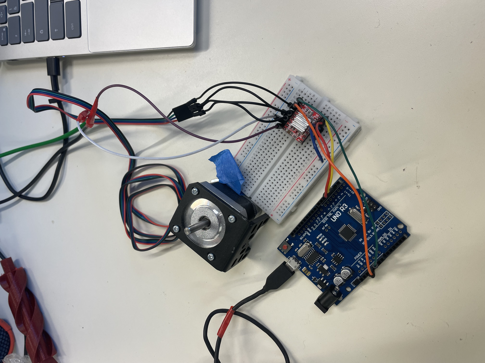

I'll finish the drilling mechanism completely for the subsequent session and put it in the frame. And I'll keep using the Lidar, water, and seed supply.

BONUS: Goodies Creation for my Polytech presentation this week-end to promote the school and the Robotic speciality.

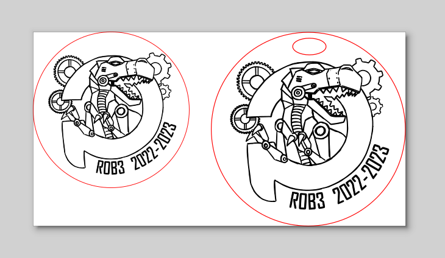